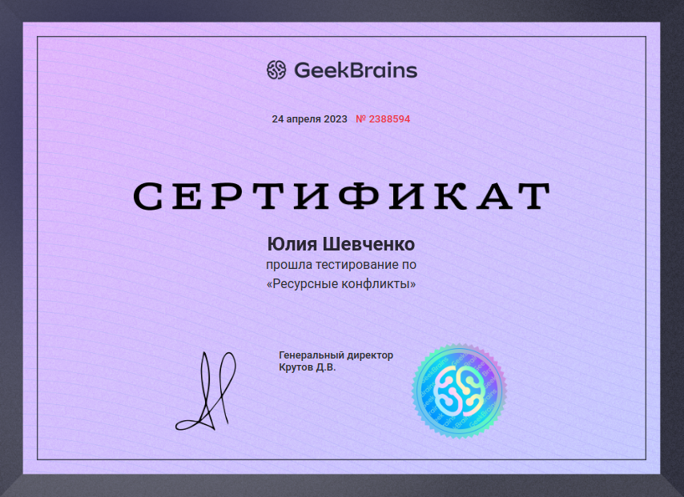

# Конфликтология (семинары)

## Практическое задание. Урок 5. Ресурсные конфликты

1. Пройти тест и определить свои способы зарядки и разрядки (минимум по 5).
2. Определить ресурс, который чаще всего вызывает конфликт (возможно, внутренний), и способ разрешения таких конфликтов.

__Тест пройден__

__Способы зарядки:__

* Путешествия
* Сон
* Общение с родными
* Прогулки у моря, в горах
* Встреча с друзьями, единомышленниками на занятиях
* Тренинги различного вида, психологические, кулинарные, личностного роста

__Способы разрядки:__

* Езда на машине в пригород
* Выпечка
* Уборка квартиры
* Громко слушать музыку в машине
* Просмотр сериалов
* Чтение книг

__Определить ресурс, который чаще всего вызывает конфликт (возможно, внутренний), и способ разрешения таких конфликтов__

* Желание достичь нескольких целей одновременно. На это не хватает ресурсов, времени, иногда просто желания, либо чувство лени.

* Противоречия желаний. Каждый раз я хочу лечь спать пораньше, чтобы хорошо высыпаться, вести здоровый образ жизни. Но при этом я всегда хочу доделать все свои дела, долго сижу за компьютером и поздно ложусь спать. С одной стороны, я выполняю все задачи, и я довольна, с другой стороны, я опять поздно легла спать и поздно проснулась, я недовольна собой.

* Самооценка, считаю тоже конфликтом. У меня немного занижена самооценка, судя по тестам и вообще жизненным ситуациям. Стремление к какому-то идеалу, хотя иногда понимаю, что невозможно быть идеальным человеком во всем.

__Способы разрешения:__

* Проанализировать ситуацию, попытаться сделать правильный выбор. Я верю в то, что человек только самостоятельно может найти правильный выход из любой ситуации, из любого конфликта.  Главное, чтобы человек сумел правильно разобраться с данной проблемой, сделать правильные выводы, благодаря которым ему удастся продолжить собственную жизнь.
* Достичь баланса. Одно из наиболее сильных стремлений всех людей заключается в достижении гармонии с самим собой, понять и принять самого себя. Если человек не находится в гармонии с самим собой, то преодолеть трудности и конфликты будет невозможно. Нужно понять, чего действительно хочется в жизни, понять свои истинные желания, а не те, что навязаны обществом. Постараться жить так, как хочется самому и получать от этого удовольствие.
* Найти свою цель в жизни, идти к ней, ставя при этом множество других целей. Считаю, что вся наша жизнь должна состоять из целей, и путей их преодоления, получать удовольствие от результата.
* Сомнения в собственной самооценке и своих силах наверно бывают у каждого человека. Не следует этого стесняться, поскольку ошибки являются частью пути. Не нужно разочаровываться, если что-то не получается или получается с большим трудом.  Также в борьбе с внутриличностным конфликтом в первую очередь требуется преодолеть собственные сомнения, потому что они усложняют ситуацию, идти всегда вперед и никогда не сдаваться!
